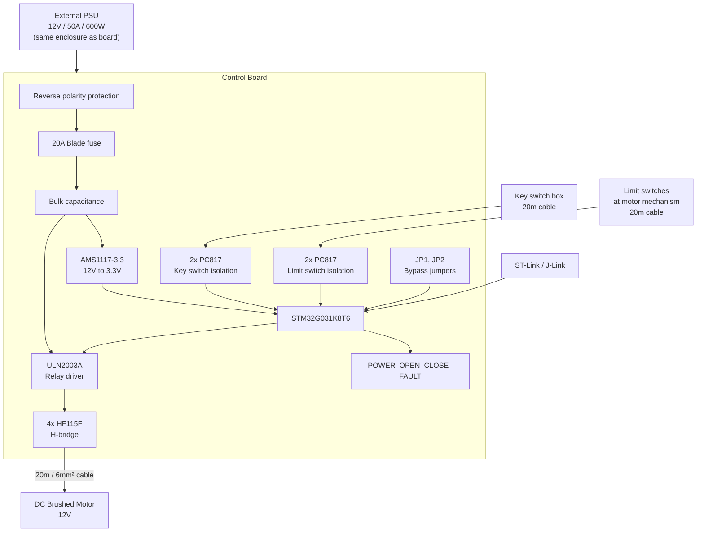
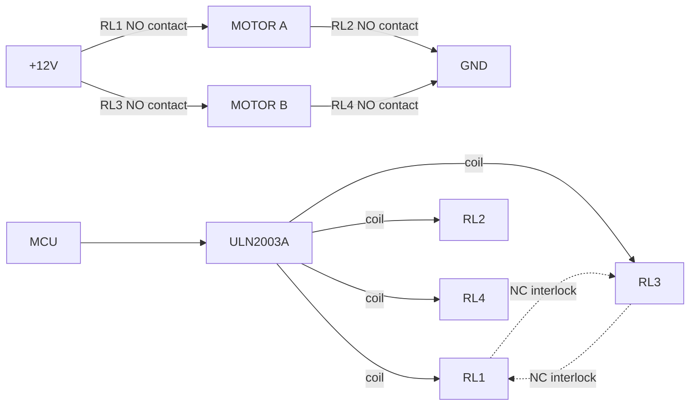
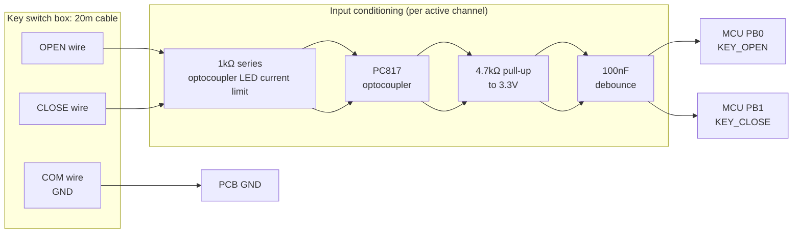
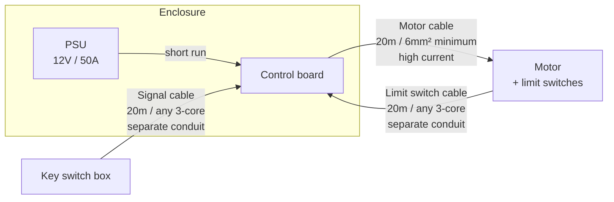
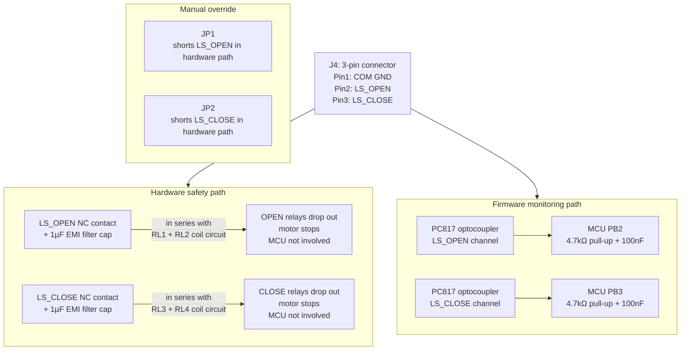
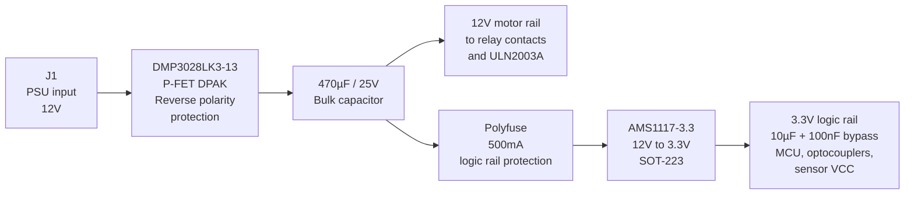
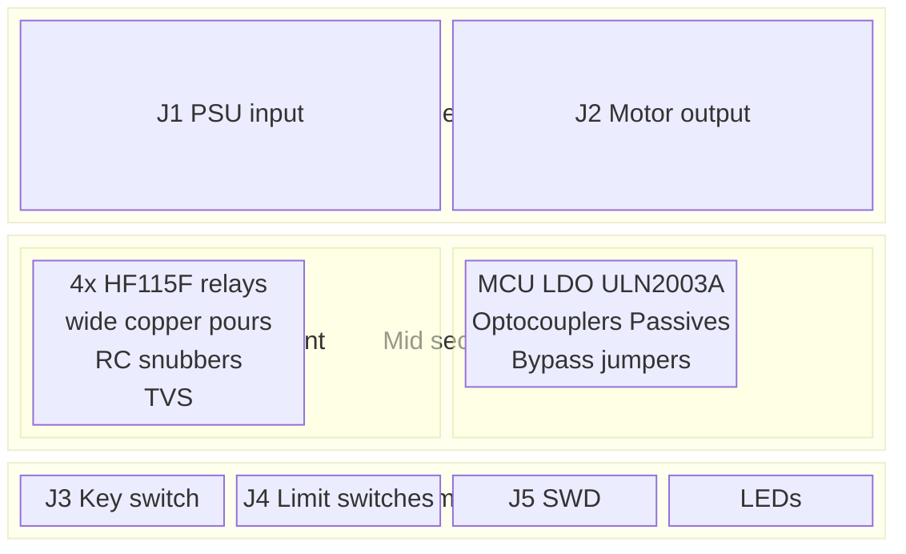
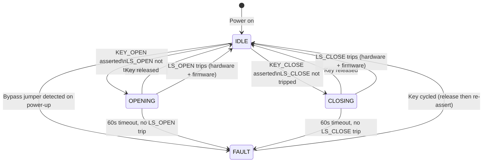
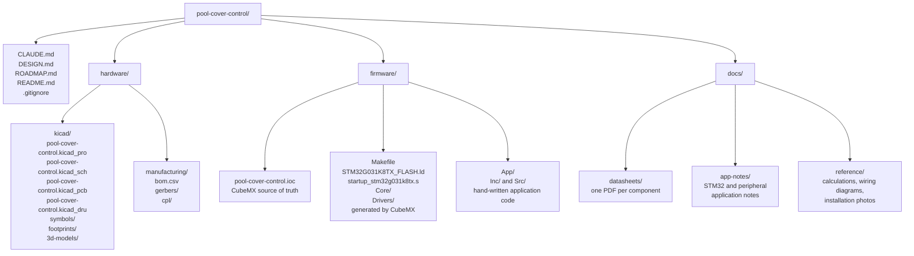

# Pool Cover Control Board: Design Document

**Project:** Automatic pool cover motor controller
**Manufacturer:** JLCPCB (PCB fabrication and PCBA)
**Status:** Design locked, ready for schematic entry

---

## System Overview

---

## 1. System Voltage

| Parameter | Value |
|-----------|-------|
| Input voltage | 12V only |
| PSU rating | 50A / 600W, customer-supplied, external |
| Motor rail | 12V direct from PSU through relay contacts |
| Logic supply | 3.3V via AMS1117-3.3 LDO, fed directly from 12V rail |
| DC-DC conversion | None |

**Rationale:** Motor is assumed 12V. Operating a 24V motor at 12V is electrically safe; the motor runs slower and with reduced torque but sustains no damage. The inverse condition (12V motor at 24V) causes immediate winding failure, so fixing the supply at 12V eliminates this risk entirely. A buck converter stage is omitted to minimise component count and failure modes.

---

## 2. Motor Current Rating

| Parameter | Value |
|-----------|-------|
| Continuous current (design target) | 15A |
| Stall current (design target) | 30A |
| Fuse | 20A, automotive blade, PCB-mounted holder |
| Relay contact rating | 30A at 14VDC minimum (HF115F series) |
| Motor PCB trace width | 3mm minimum, 2oz copper |

**Rationale:** Sizing for the mid-range residential pool cover bracket. The 20A fuse provides adequate inrush headroom to avoid nuisance trips while protecting relay contacts and PCB traces below their rated limits. The 50A PSU capacity is intentionally oversized; the fuse is the active protection boundary.

---

## 3. H-Bridge Topology

| Parameter | Value |
|-----------|-------|
| Topology | Full H-bridge, 4x SPST-NO relays |
| Relay part | HF115F-V-012-1ZS (Hongfa, 12V coil, 30A / 14VDC contacts, PCB through-hole) |
| Driver IC | ULN2003A Darlington array, SOIC-16 (drives all 4 coils; 3 channels spare) |
| Hardware interlock | NC contact of RL1 in series with RL3 coil circuit, and vice versa |
| RC snubber | 100Ω + 10nF in series, across each relay contact pair |

**Bridge states:**

| State | Relays energised | Motor condition |
|-------|-----------------|-----------------|
| OPEN | RL1 + RL2 | Runs, open direction |
| CLOSE | RL3 + RL4 | Runs, close direction |
| STOP | None | Floating (coast) |
| FAULT (shoot-through) | RL1+RL3 or RL2+RL4 | Physically impossible via NC interlock |

**Rationale:** Four SPST-NO relays give a clean open-circuit stop state and source well from JLCPCB/LCSC stock. The hardware NC interlock prevents H-bridge shoot-through independently of firmware. The RC snubber is mandatory given the 20m inductive motor cable; without it, contact arcing significantly reduces relay service life.

---

## 4. Microcontroller

| Parameter | Value |
|-----------|-------|
| Part | STM32G031K8T6 |
| Core | ARM Cortex-M0+, 64 MHz |
| Flash | 64KB |
| RAM | 8KB |
| Package | LQFP-32 |
| GPIO available | 25 |
| Clock source | Internal HSI oscillator, no crystal required |

**Peripheral allocation:**

| Signal | Direction | Peripheral | Pin |
|--------|-----------|-----------|-----|
| RL1 OPEN high-side | Output | GPIO | PA0 |
| RL2 OPEN low-side | Output | GPIO | PA1 |
| RL3 CLOSE high-side | Output | GPIO | PA2 |
| RL4 CLOSE low-side | Output | GPIO | PA3 |
| LED_OPEN | Output | GPIO | PA4 |
| LED_CLOSE | Output | GPIO | PA5 |
| LED_FAULT | Output | GPIO | PA6 |
| JP1 bypass sense | Input | GPIO | PA7 |
| JP2 bypass sense | Input | GPIO | PA8 |
| SWDIO | Bidirectional | SWD | PA13 |
| SWDCK | Input | SWD | PA14 |
| KEY_OPEN | Input | GPIO | PB0 |
| KEY_CLOSE | Input | GPIO | PB1 |
| LS_OPEN | Input | GPIO | PB2 |
| LS_CLOSE | Input | GPIO | PB3 |

**Rationale:** Direct upgrade from the originally specified STM32G030K6T6. Identical LQFP-32 footprint, 2x flash capacity (64KB vs 32KB), $0.20 cost delta at prototype quantities. The additional flash headroom accommodates the state machine, Flash EEPROM emulation for configuration, and future firmware features without a board respin.

---

## 5. Key Switch Interface

| Parameter | Value |
|-----------|-------|
| Connector | J3, MSTB-compatible 3-pin 5.08mm |
| Pinout | Pin 1: COM (GND) / Pin 2: OPEN / Pin 3: CLOSE |
| Switch type | 3-position maintained rotary key switch (OPEN / OFF / CLOSE) |
| Common wire | GND (confirmed) |
| Isolation | 2x PC817 optocoupler, one per active input |
| LED current limiting | 1kΩ series resistor per optocoupler LED |
| MCU input conditioning | 4.7kΩ pull-up to 3.3V + 100nF debounce capacitor |
| Logic polarity | Active-low at MCU GPIO after optocoupler inversion |

**MCU input states:**

| KEY_OPEN (PB0) | KEY_CLOSE (PB1) | Command |
|---------------|----------------|---------|
| LOW | HIGH | OPEN |
| HIGH | LOW | CLOSE |
| HIGH | HIGH | STOP |
| LOW | LOW | STOP (treated as invalid) |

**Rationale:** The 20m cable run to the key switch box is exposed to environmental EMI and potential ground potential differences. Optocouplers provide galvanic isolation, eliminate ground loop currents, and protect the MCU from cable-induced ESD transients.

---

## 6. Cable Architecture

| Cable | Length | Minimum cross-section | Voltage drop at 15A | Motor terminal voltage |
|-------|--------|----------------------|--------------------|-----------------------|
| Motor power | 20m | 6mm² | 1.8V | 10.2V |
| Key switch signal | 20m | 0.5mm² (any standard) | Negligible | N/A |
| Limit switch signal | 20m | 0.5mm² (any standard) | Negligible | N/A |

**Installation rules:**

**Motor cable cross-section:** 6mm² minimum. Undersized cable produces excessive voltage drop and resistive heating. Do not route in the same conduit as signal cables.

**Conduit separation:** Motor power cable and all signal cables (key switch, limit switches) must run in separate conduits. Switching a 15A inductive load induces noise on parallel conductors sufficient to cause false triggering of optocoupler inputs.

**TVS protection:** SMDJ15A bidirectional TVS fitted across motor output terminals on PCB. A 20m cable exhibits significant inductance; relay contact opening generates voltage spikes that would otherwise damage relay contacts and stress PCB traces.

---

## 7. Limit Switch Interface

| Parameter | Value |
|-----------|-------|
| Connector | J4, MSTB-compatible 3-pin 5.08mm |
| Pinout | Pin 1: COM (GND) / Pin 2: LS_OPEN / Pin 3: LS_CLOSE |
| Switch type | Two NC (normally closed) mechanical limit switches, shared common GND |
| Hardware safety path | NC contact of each switch wired in series with corresponding relay coil pair |
| EMI noise filter | 1µF capacitor across each switch input, filtering transients shorter than 10ms (relay release time) |
| MCU monitoring path | 2x PC817 optocoupler; 4.7kΩ pull-up to 3.3V + 100nF debounce per channel |
| Manual override | JP1 (LS_OPEN bypass) and JP2 (LS_CLOSE bypass): 2-pin headers that short-circuit the NC contact in the hardware coil path |

**Rationale:** The hardware series path stops the motor without MCU involvement. Relay coils lose power the instant the switch opens. Optocouplers on the firmware monitoring path are warranted by the 20m cable run through a motor EMI environment. The 1µF filter cap prevents motor switching transients conducted via the shared cable run from causing spurious relay dropout in the hardware path. Bypass jumpers allow commissioning and fault diagnosis when limit switch continuity cannot be confirmed.

---

## 8. Power Architecture

| Component | Part | Function |
|-----------|------|----------|
| Q1 | DMP3028LK3-13 (TO-252 DPAK, P-FET) | Reverse polarity protection — −30V, −27A, 25mΩ. Replaces AO3401 which was undersized (4.2A) and violated Vgs(max) at 12V gate drive |
| C1 | 470µF / 25V electrolytic | 12V bulk capacitance, absorbs relay coil switching transients |
| PF1 | Polyfuse 500mA | Isolates logic rail fault from motor rail |
| U3 | AMS1117-3.3 (SOT-223) | 12V to 3.3V LDO, 1A rated, 435mW dissipation at 50mA load |
| C2 | 10µF / 25V MLCC | LDO input bulk |
| C3 | 10µF / 25V MLCC | LDO output bulk |
| C4–C10 | 100nF MLCC | MCU and IC decoupling |

**Note on Q1 thermal:** At 15A motor current, Q1 dissipation is 15² × 0.025 = 5.6W. The DPAK tab must be soldered to a copper pour of at least 1cm² on the PCB top layer for adequate thermal management.

**Note on LDO thermal:** At 50mA logic load, LDO dissipation is (12 − 3.3) × 0.05 = 435mW. The SOT-223 package is rated for this dissipation with adequate PCB copper pour on the tab pad.

**Note on AMS1117 input limit:** Maximum input voltage is 15V. Confirmed safe on a 12V-only system (see Section 1).

---

## 9. Status Indicators

| Designator | Colour | Package | Driven by | Condition indicated |
|------------|--------|---------|-----------|-------------------|
| LED1 | Green | 0603 | 3.3V rail direct via 330Ω | Board powered, always on, MCU-independent |
| LED2 | Blue | 0603 | MCU PA4 via 330Ω | Motor running, open direction |
| LED3 | Yellow | 0603 | MCU PA5 via 330Ω | Motor running, close direction |
| LED4 | Red | 0603 | MCU PA6 via 330Ω | Fault: timeout, bypass jumper active, or invalid input |

All four LEDs placed as a group on the top layer, positioned to remain visible through an enclosure window or panel knock-out.

---

## 10. Connectors and Terminals

| Ref | Function | Type | Pins | Pitch | Current rating | Pinout |
|-----|----------|------|------|-------|---------------|--------|
| J1 | PSU input | MSTB-compatible, pluggable | 4 | 5.08mm | 24A (2 pins parallel per conductor) | 1+2: +12V / 3+4: GND |
| J2 | Motor output | MSTB-compatible, pluggable | 4 | 5.08mm | 24A (2 pins parallel per conductor) | 1+2: MOTOR_A / 3+4: MOTOR_B |
| J3 | Key switch | MSTB-compatible, pluggable | 3 | 5.08mm | 12A | 1: COM(GND) / 2: OPEN / 3: CLOSE |
| J4 | Limit switches | MSTB-compatible, pluggable | 3 | 5.08mm | 12A | 1: COM(GND) / 2: LS_OPEN / 3: LS_CLOSE |
| J5 | SWD debug | 1x4 pin header | 4 | 2.54mm | N/A | VREF / SWDIO / SWDCK / GND |
| JP1 | LS_OPEN bypass | 2-pin header | 2 | 2.54mm | N/A | Short to bypass LS_OPEN hardware path |
| JP2 | LS_CLOSE bypass | 2-pin header | 2 | 2.54mm | N/A | Short to bypass LS_CLOSE hardware path |

**Connector family:** Phoenix Contact MSTB 2.5 compatible throughout. Chinese-manufactured equivalents (Degson DG128, Dinkle, WJ series) are drop-in footprint compatible and available at LCSC. Using a single pitch (5.08mm) across all field connectors means the installer carries one type of mating plug body.

**High-current pins in parallel:** The MSTB 2.5 contact is rated 12A per pin at 40°C. Paralleling two pins per conductor on J1 and J2 gives 24A combined rating, above the 20A fuse limit.

**Silkscreen:** Pin 1 marked on all connectors. Parallel power pins labelled individually (example: `+12V +12V GND GND`).

**Assembly note:** All connectors are through-hole. Mating plug bodies are ordered separately and field-wired by the installer. Verify JLCPCB hand-soldering availability for through-hole components at time of order.

---

## 11. PCB Specification

| Parameter | Value |
|-----------|-------|
| Dimensions | 100 x 100mm |
| Layer count | 4 |
| Copper weight | 2oz (70µm) all layers |
| Motor trace width | 3mm minimum |
| Logic trace width | 0.2mm minimum |
| Surface finish | ENIG |
| Soldermask colour | Green |
| Minimum via drill | 0.3mm |
| Minimum via annular ring | 0.6mm |

**Layer stackup:**

| Layer | Purpose |
|-------|---------|
| L1 Top | Component placement, signal routing, wide motor current traces |
| L2 | Solid GND plane providing EMI shielding between motor and logic sections |
| L3 | 12V and 3.3V power pours |
| L4 Bottom | Secondary signal routing, thermal relief for LDO pad |

**Board zone allocation:**

**Design rules:**
Motor current paths (PSU input through fuse, relay contacts, motor output) are kept on the top layer with 3mm minimum width copper and supplemented by L3 power pours. The solid GND plane on L2 physically separates the high-current switching zone (left) from the MCU and analog signal zone (right).

**Post-assembly:** Conformal coating is required before installation. The board operates in a pool enclosure subject to humidity and condensation.

---

## 12. Firmware State Machine

**Behavioural rules:**

| Condition | Response |
|-----------|----------|
| KEY_OPEN and KEY_CLOSE simultaneously asserted | STOP, no movement |
| Key released mid-travel | Motor stops immediately, all relays de-energised |
| Limit switch trips during travel | Hardware stops motor; firmware transitions to IDLE and inhibits re-command in same direction |
| 60s timeout with no limit switch trip | FAULT state; LED_FAULT on solid; motor stopped |
| Bypass jumper installed at power-on | Motor enabled; LED_FAULT blinks continuously as warning |
| Firmware lockup | Internal IWDG watchdog fires within 1s; all relay outputs forced low |

**No homing sequence is required.** The limit switches are the sole position reference. The system has two valid states (fully open, fully closed) and one valid mid-travel transition; absolute position tracking is not needed.

---

## Bill of Materials (Preliminary)

| Ref | Part number | Description | Package | Qty |
|-----|-------------|-------------|---------|-----|
| U1 | STM32G031K8T6 | MCU, Cortex-M0+, 64KB flash | LQFP-32 | 1 |
| U2 | ULN2003ADRE4 | 7-channel Darlington relay driver | SOIC-16 | 1 |
| U3 | AMS1117-3.3 | LDO regulator, 12V to 3.3V, 1A | SOT-223 | 1 |
| Q1 | DMP3028LK3-13 | P-channel MOSFET, reverse polarity protection, −30V −27A | TO-252 DPAK | 1 |
| RL1–RL4 | HF115F-V-012-1ZS | SPDT relay, 12V coil, 30A contacts | PCB through-hole | 4 |
| OC1–OC4 | PC817 | Optocoupler (2x key switch, 2x limit switch) | SOP-4 | 4 |
| F1 | TBD | Blade fuse holder, 20A automotive, PCB mount | Through-hole | 1 |
| D1 | SMBJ15CA | Bidirectional TVS, motor output protection, 15V 600W | SMB DO-214AA | 1 |
| D2–D5 | SS14 | Schottky diode, relay coil flyback | SMA | 4 |
| LED1 | TBD | LED green | 0603 | 1 |
| LED2 | TBD | LED blue | 0603 | 1 |
| LED3 | TBD | LED yellow | 0603 | 1 |
| LED4 | TBD | LED red | 0603 | 1 |
| J1 | DG128-5.08-04P | Pluggable terminal block socket, 4-pin, 5.08mm | Through-hole | 1 |
| J2 | DG128-5.08-04P | Pluggable terminal block socket, 4-pin, 5.08mm | Through-hole | 1 |
| J3 | DG128-5.08-03P | Pluggable terminal block socket, 3-pin, 5.08mm | Through-hole | 1 |
| J4 | DG128-5.08-03P | Pluggable terminal block socket, 3-pin, 5.08mm | Through-hole | 1 |
| J5 | TBD | Pin header, 2x2, 1.27mm pitch, SWD | Through-hole | 1 |
| JP1–JP2 | TBD | Pin header, 1x2, 2.54mm pitch, bypass jumpers | Through-hole | 2 |
| C1 | TBD | Electrolytic capacitor, 470µF / 25V | Through-hole | 1 |
| C2–C3 | TBD | MLCC capacitor, 10µF / 25V, LDO bulk | 0805 | 2 |
| C4–C10 | TBD | MLCC capacitor, 100nF, decoupling and debounce | 0402 | 7 |
| C11–C12 | TBD | MLCC capacitor, 1µF, limit switch EMI filter | 0603 | 2 |
| C13–C16 | TBD | MLCC capacitor, 10nF / 100V, RC snubber | 0603 | 4 |
| R1–R4 | TBD | Resistor, 330Ω, LED series | 0402 | 4 |
| R5–R8 | TBD | Resistor, 4.7kΩ, GPIO pull-up | 0402 | 4 |
| R9–R12 | TBD | Resistor, 1kΩ, optocoupler LED series | 0402 | 4 |
| R13–R16 | TBD | Resistor, 10kΩ, signal conditioning | 0402 | 4 |
| R17–R20 | TBD | Resistor, 100Ω, RC snubber | 0603 | 4 |

---

## Repository Structure

**Directory descriptions:**

| Directory | Contents |
|-----------|----------|
| `hardware/kicad/` | KiCad project files, custom symbol library, custom footprint library, custom 3D models |
| `hardware/manufacturing/` | Gerber files, JLCPCB BOM CSV, component placement list — one subdirectory per board revision |
| `firmware/` | CubeMX `.ioc` project, CubeMX-generated files (`Core/`, `Drivers/`, `Makefile`, linker script, startup) |
| `firmware/App/` | Hand-written application code only: state machine, motor control, debounce, LED logic |
| `docs/datasheets/` | One PDF per component, named by part number (example: `STM32G031K8T6.pdf`, `HF115F.pdf`) |
| `docs/app-notes/` | STM32 and peripheral application notes referenced during design or firmware development |
| `docs/reference/` | Voltage drop calculations, wiring diagrams, installation photographs, any other reference material |

**Git strategy:**

| Item | Committed |
|------|-----------|
| All source files including CubeMX-generated `Core/` and `Drivers/` | Yes, ensures the repo builds without a matching CubeMX installation |
| `hardware/manufacturing/` Gerbers and BOM | Yes, each order must be reproducible from the commit that produced it |
| `firmware/build/` compiler output | No, gitignored |
| KiCad backup files (`*.kicad_pcb-bak`, `_autosave*`, `fp-info-cache`, `*.kicad_prl`) | No, gitignored |
| OS metadata (`.DS_Store`, `Thumbs.db`) | No, gitignored |

**Folders are created on demand** as each project phase begins, not upfront.

---

## Installation Requirements

**Motor cable:** 6mm² copper minimum for the 20m run. A smaller cross-section produces unacceptable voltage drop (reference: 1.5mm² yields 7.2V drop at 15A; motor receives only 4.8V). Route in dedicated conduit, separate from all signal cables.

**Signal cables:** Any standard 3-core cable for the 20m runs to the key switch box and limit switches. Signal currents are below 50mA; voltage drop is negligible. Route in conduit separate from the motor power cable.

**Conduit separation:** Motor switching currents in the power cable induce noise in parallel conductors. Running power and signal cables in the same conduit will cause false triggering of limit switch and key switch inputs regardless of the optocoupler and filter provisions on the PCB.

**Enclosure:** IP65 minimum. The board operates adjacent to a swimming pool; humidity and condensation are permanent operating conditions.

**Conformal coating:** Apply to the fully assembled and tested PCB before installation. Use a coating compatible with the enclosure operating temperature range.
