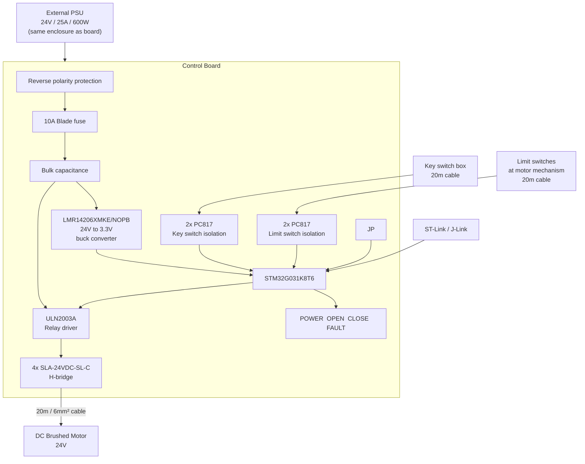
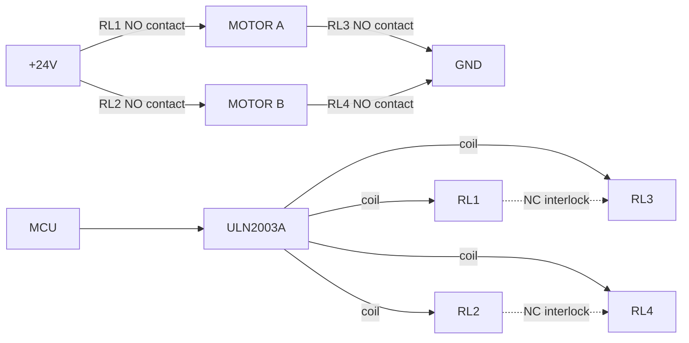
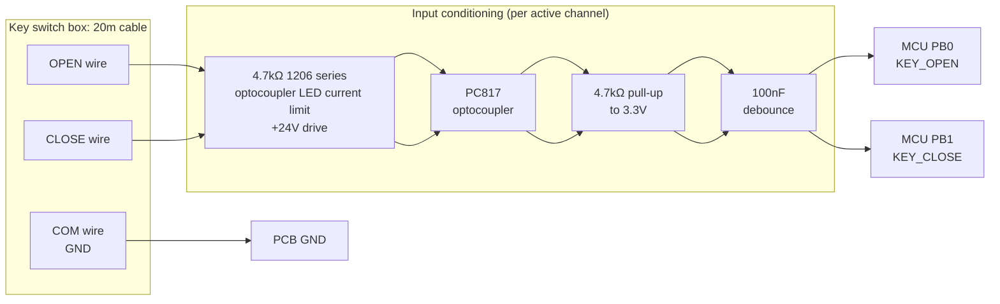
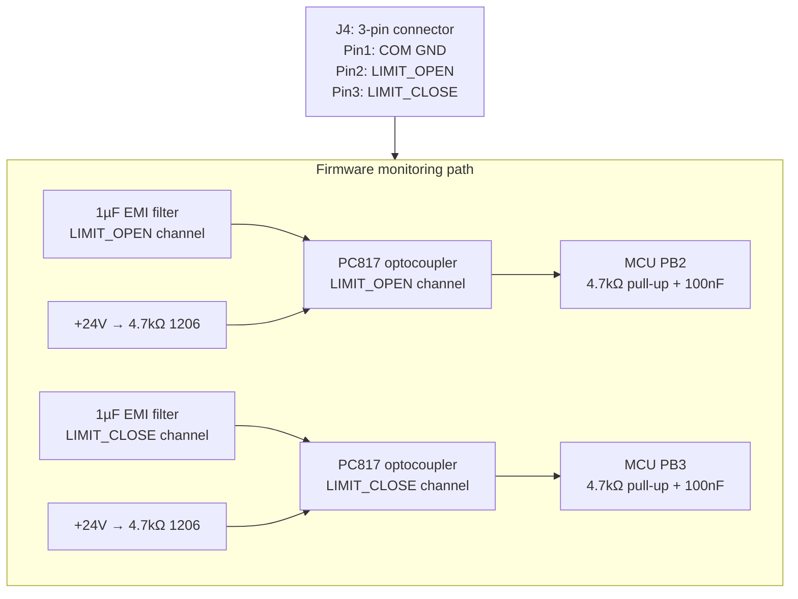
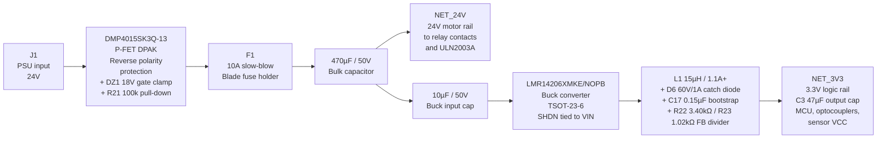
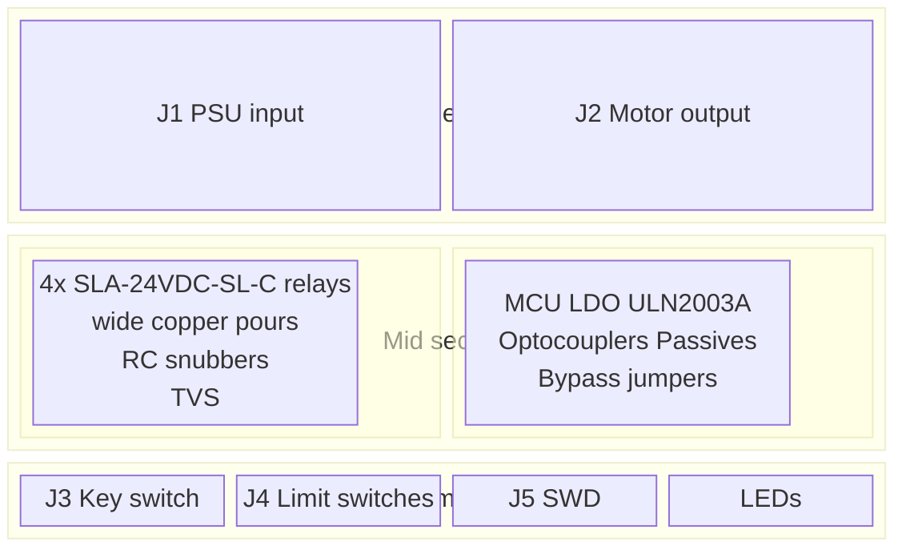
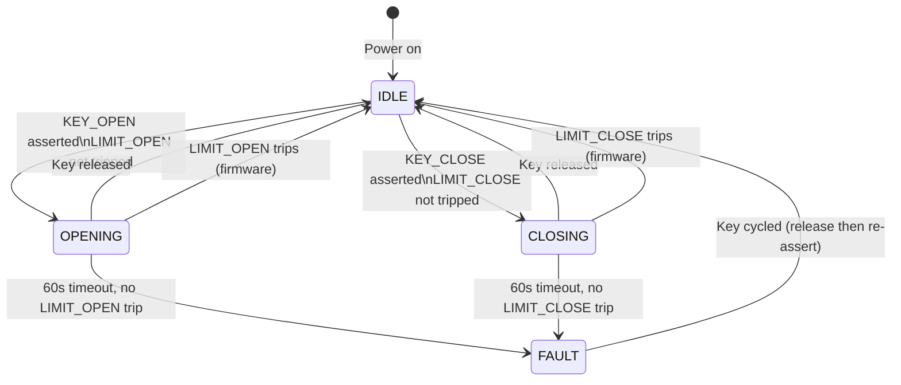
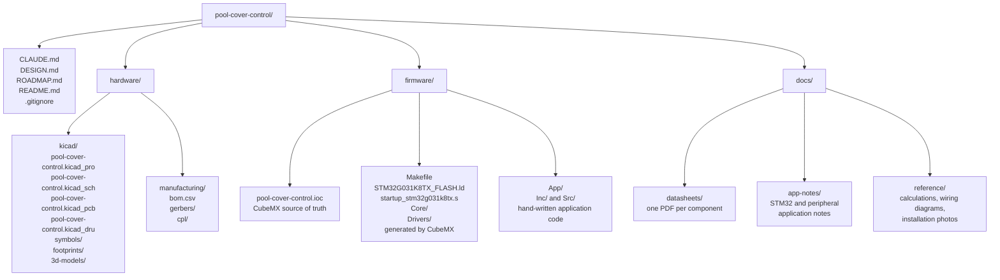

# Pool Cover Control Board: Design Document

**Project:** Automatic pool cover motor controller
**Manufacturer:** JLCPCB (PCB fabrication and PCBA)
**Status:** Design locked, ready for schematic entry

---

## System Overview

---

## 1. System Voltage

| Parameter | Value |
|-----------|-------|
| Input voltage | 24V |
| PSU rating | 25A / 600W, customer-supplied, external |
| Motor rail | 24V direct from PSU through relay contacts |
| Logic supply | 3.3V via LMR14206XMKE/NOPB buck converter, fed directly from 24V motor rail |
| DC-DC conversion | LMR14206XMKE/NOPB synchronous buck, 24V to 3.3V, 600mA rated, 1.25MHz |

**Rationale:** The motor is rated 24V DC, confirmed from the original installation documentation (230V/24V 200VA transformer feeding a bridge rectifier and filter capacitor). A direct field test was performed by connecting the motor to a 12V drill battery at the installed site; the motor ran the cover through full travel, confirming the mechanism is functional. Despite this test, the design voltage is set at 24V to match the motor rating: operating at rated voltage delivers the designed torque and speed margin, avoids winding thermal stress from continuous overcurrent at reduced voltage, and simplifies future servicing. A 24V switching PSU at 25A/600W is selected; switching type is appropriate for this application (regulated output, compact form factor, no transformer hum, wide input range). A linear LDO cannot be used at 24V input: no standard SOT-223 or SOT-89 LDO with Vin(max) ≥ 24V and a 3.3V output is available on LCSC in the required quantity. At 24V input and 50mA load the dropout voltage is 20.7V, producing 1.035W of heat in a small package. The LMR14206XMKE/NOPB synchronous buck converter (Vin 4.5–42V, 600mA, 1.25MHz) is used instead. At 50mA load the buck dissipates approximately 29mW at 85% typical efficiency, eliminating the thermal design risk. The 1.25MHz switching frequency allows compact external passives (15µH inductor, 47µF output capacitor) that fit within the logic section of the board.

---

## 2. Motor Current Rating

| Parameter | Value |
|-----------|-------|
| Motor rated voltage | 24V DC (confirmed from previous system documentation) |
| Supply voltage | 24V (design requirement; see Section 1) |
| Estimated running current at 24V | 3–6A (not measured; verify at commissioning, see OI-1) |
| Estimated stall current at 24V | up to 8.3A (limited by original 200VA/24V transformer secondary; previous system used 15A DC protection, which was oversized relative to transformer) |
| Fuse | 10A slow-blow, automotive blade, PCB-mounted holder |
| Relay contact rating | 30A (SLA-24VDC-SL-C, 30A contacts) |
| Motor PCB trace width | 3mm minimum, 2oz copper |

**Rationale:** The motor is rated 24V. The original supply was a 200VA/24V transformer feeding a bridge rectifier and filter capacitor; the transformer secondary current limit is 200/24 = 8.33A. The previous DC-side protection was a 15A thermal breaker, which was oversized relative to the transformer and served primarily as cable protection rather than motor current limiting.

A fuse cannot protect against motor stall in this application: starting inrush exceeds stall current briefly, and a fuse rated low enough to blow on stall would also blow on inrush. Stall protection is provided by the firmware 60s timeout (see Section 12). The fuse protects against PCB wiring faults, connector shorts, and dead shorts.

A 10A slow-blow (T-type) automotive blade fuse is selected. It carries the estimated 3–6A running current at 60% of rating with good thermal margin, tolerates motor starting inrush (slow-blow characteristic holds 2× rated for approximately 10 seconds), and provides fault protection well below the transformer secondary limit of 8.33A and the 3mm/2oz PCB trace current limit of approximately 15A. The PSU capacity is intentionally oversized relative to the fuse; the fuse is the active protection boundary. Running current must be measured at commissioning (see OI-1).

---

## 3. H-Bridge Topology

| Parameter | Value |
|-----------|-------|
| Topology | Full H-bridge, 4x SPDT relays |
| Relay part | SLA-24VDC-SL-C (Songle, 24V coil, 30A contacts, PCB through-hole, 6-pin 32x27.6mm; LCSC part number to be confirmed at task 2.8) |
| Driver IC | ULN2003A Darlington array, SOIC-16 (drives all 4 coils; 3 channels spare) |
| Hardware interlock | NC contact of RL1 in series with RL3 coil A1 supply; NC contact of RL2 in series with RL4 coil A1 supply; one-way column interlocks |
| RC snubber | 100Ω + 10nF in series, across each relay contact pair |

**Relay roles:**

| Relay | Role | COM | NO | NC |
|-------|------|-----|----|----|
| RL1 | High-side A | +24V | MOTOR A | RL3 coil A1 supply |
| RL2 | High-side B | +24V | MOTOR B | RL4 coil A1 supply |
| RL3 | Low-side A | MOTOR A | GND | no-connect |
| RL4 | Low-side B | MOTOR B | GND | no-connect |

**Bridge states:**

| State | Relays energised | Motor condition |
|-------|-----------------|-----------------|
| OPEN | RL1 + RL4 | Runs, open direction |
| CLOSE | RL2 + RL3 | Runs, close direction |
| STOP | None | Floating (coast) |
| FAULT (shoot-through) | RL1+RL3 or RL2+RL4 | Physically impossible via NC interlock |

**Rationale:** Four SPDT relays give a clean open-circuit stop state and source well from JLCPCB/LCSC stock. RL1 and RL2 are the high-side relays (COM=+24V): energising RL1 connects MOTOR_A to +24V; energising RL2 connects MOTOR_B to +24V. RL3 and RL4 are the low-side relays (COM=MOTOR_A and MOTOR_B respectively): energising RL3 connects MOTOR_A to GND; energising RL4 connects MOTOR_B to GND. The NC contacts implement one-way column interlocks: the RL1 NC contact (COM=+24V) is the sole coil A1 supply for RL3; the RL2 NC contact (COM=+24V) is the sole coil A1 supply for RL4. When RL1 energises, its NC contact opens, cutting coil A1 power to RL3, which cannot then energise regardless of firmware state. This prevents the direct +24V-to-GND short-circuit paths RL1+RL3 (MOTOR_A shorted) and RL2+RL4 (MOTOR_B shorted). The interlock is one-directional: RL3 and RL4 have their NC contacts terminated with no-connects and carry no interlock function. Break-before-make is naturally enforced on each column: RL3 cannot re-energise until RL1 has fully released and its NC contact has closed again. The RC snubber is mandatory given the 20m inductive motor cable; without it, contact arcing significantly reduces relay service life.

**Note on contact rating:** The SLA-24VDC-SL-C contact rating is 30A, well above the estimated 8.33A stall current at 24V (transformer secondary limit). The 10A fuse is the active protection boundary. Running current must be measured at commissioning (see OI-1) to confirm the 10A fuse carries it without nuisance blowing on starting; increase to 15A if starting inrush repeatedly trips the fuse.

**Note on relay footprint (open item OI-4):** The SLA-12VDC-SL-C and SLA-24VDC-SL-C share the same PCB footprint (same mechanical body). The custom footprint places the contact and NPTH columns at ±8.9mm from the body centre (4.9mm margin to each body edge). The datasheet dimension for this margin could not be read with certainty at available image resolution. Before sending for manufacture, measure the physical relay sample and confirm the column x-positions match the footprint. Adjust pad and NPTH x-coordinates if the margin is 4.4mm (columns at ±9.4mm) rather than 4.9mm.

---

## 4. Microcontroller

| Parameter | Value |
|-----------|-------|
| Part | STM32G031K8T6 |
| Core | ARM Cortex-M0+, 64 MHz |
| Flash | 64KB |
| RAM | 8KB |
| Package | LQFP-32 |
| GPIO available | 25 |
| Clock source | Internal HSI oscillator, no crystal required |

**Peripheral allocation:**

| Signal | Direction | Peripheral | Pin |
|--------|-----------|-----------|-----|
| RL1 OPEN high-side | Output | GPIO | PA0 |
| RL2 CLOSE high-side | Output | GPIO | PA1 |
| RL3 CLOSE low-side | Output | GPIO | PA2 |
| RL4 OPEN low-side | Output | GPIO | PA3 |
| LED_OPEN | Output | GPIO | PA4 |
| LED_CLOSE | Output | GPIO | PA5 |
| LED_FAULT | Output | GPIO | PA6 |
| SWDIO | Bidirectional | SWD | PA13 |
| SWDCK | Input | SWD | PA14 |
| KEY_OPEN | Input | GPIO | PB0 |
| KEY_CLOSE | Input | GPIO | PB1 |
| LIMIT_OPEN | Input | GPIO | PB2 |
| LIMIT_CLOSE | Input | GPIO | PB3 |

**Rationale:** Direct upgrade from the originally specified STM32G030K6T6. Identical LQFP-32 footprint, 2x flash capacity (64KB vs 32KB), $0.20 cost delta at prototype quantities. The additional flash headroom accommodates the state machine, Flash EEPROM emulation for configuration, and future firmware features without a board respin.

---

## 5. Key Switch Interface

| Parameter | Value |
|-----------|-------|
| Connector | J3, MSTB-compatible 3-pin 5.08mm |
| Pinout | Pin 1: COM (GND) / Pin 2: OPEN / Pin 3: CLOSE |
| Switch type | 3-position maintained rotary key switch (OPEN / OFF / CLOSE) |
| Common wire | GND (confirmed) |
| Isolation | 2x PC817 optocoupler, one per active input |
| LED current limiting | 4.7kΩ 1206 series resistor per optocoupler LED, driven from +24V; IF = (24V − 1.25V) / 4.7kΩ ≈ 4.8mA |
| MCU input conditioning | 4.7kΩ pull-up to 3.3V + 100nF debounce capacitor |
| Logic polarity | Active-low at MCU GPIO after optocoupler inversion |

**MCU input states:**

| KEY_OPEN (PB0) | KEY_CLOSE (PB1) | Command |
|---------------|----------------|---------|
| LOW | HIGH | OPEN |
| HIGH | LOW | CLOSE |
| HIGH | HIGH | STOP |
| LOW | LOW | STOP (treated as invalid) |

**Rationale:** The 20m cable run to the key switch box is exposed to environmental EMI and potential ground potential differences. Optocouplers provide galvanic isolation, eliminate ground loop currents, and protect the MCU from cable-induced ESD transients.

---

## 6. Cable Architecture

| Cable | Length | Minimum cross-section | Voltage drop at 8A | Motor terminal voltage |
|-------|--------|----------------------|--------------------|-----------------------|
| Motor power | 20m | 6mm² | 0.9V | 23.1V |
| Key switch signal | 20m | 0.5mm² (any standard) | Negligible | N/A |
| Limit switch signal | 20m | 0.5mm² (any standard) | Negligible | N/A |

**Installation rules:**

**Motor cable cross-section:** 6mm² minimum. Undersized cable produces excessive voltage drop and resistive heating. Do not route in the same conduit as signal cables.

**Conduit separation:** Motor power cable and all signal cables (key switch, limit switches) must run in separate conduits. Switching a 15A inductive load induces noise on parallel conductors sufficient to cause false triggering of optocoupler inputs.

**TVS protection:** SMBJ28CA bidirectional TVS fitted across motor output terminals on PCB. Standoff voltage 28V is above the 24V rail with adequate margin; clamping voltage at peak pulse is approximately 45V. A 20m cable exhibits significant inductance; relay contact opening generates voltage spikes that would otherwise damage relay contacts and stress PCB traces.

---

## 7. Limit Switch Interface

| Parameter | Value |
|-----------|-------|
| Connector | J4, MSTB-compatible 3-pin 5.08mm |
| Pinout | Pin 1: COM (GND) / Pin 2: LIMIT_OPEN / Pin 3: LIMIT_CLOSE |
| Sensor type | Unconfirmed; 3-wire cable confirmed; designed for NC dry contact with shared common GND |
| EMI noise filter | 1µF capacitor from each signal input to GND |
| LED current limiting | 4.7kΩ 1206 series resistor per optocoupler LED, driven from +24V; IF = (24V − 1.25V) / 4.7kΩ ≈ 4.8mA |
| MCU monitoring path | 2x PC817 optocoupler; 4.7kΩ pull-up to 3.3V + 100nF debounce per channel; MCU PB2 (LIMIT_OPEN), PB3 (LIMIT_CLOSE) |
| Relay coil supply | RL1 A1 and RL2 A1 connected directly to +24V; no series limit switch path |

**Rationale:** The sensor type is not confirmed. The system uses cam-operated micro-rupteurs inside the motor gearbox accessed via a sensor cable; the cable on this installation is 3-wire (shared common + one signal per direction) and the contact polarity has not been verified on-site. A hardware series path in the relay coil circuit was evaluated but rejected: a misconnection or unknown sensor polarity in the hardware path would permanently prevent motor operation rather than degrading gracefully. If limit switch operation cannot be confirmed on-site, a firmware build without limit switch support is flashed and J4 is left unconnected; no hardware bypass mechanism is required. A hardware coil series path can be added at a future board revision once the sensor interface is confirmed and tested.

Optocouplers are warranted by the approximate 20m cable run through a motor EMI environment. The 1µF filter cap on each signal line suppresses motor switching transients conducted via the shared cable before they reach the optocoupler LED.

---

## 8. Power Architecture

| Component | Part | Function |
|-----------|------|----------|
| Q1 | DMP4015SK3Q-13 (TO-252 DPAK, P-FET) | Reverse polarity protection — −40V, −35A, 11mΩ max. Gate clamped by DZ1 (18V Zener) to −18V (80% derating of Vgs(max) = ±25V) |
| DZ1 | MM1W18 (SOD-123, LCSC C382948) | Q1 gate clamp: limits Vgs to −18V when supply is 24V, protecting gate oxide. Vz range 16.8–19.2V; worst case VGS = −19.2V, within 80% derating of ±25V. Zzt = 20Ω; Pd = 1W. Placed cathode to Source, anode to Gate. |
| R21 | 100kΩ, 0402 | Q1 gate pull-down: ensures Q1 is off when J1 is disconnected |
| C1 | 470µF / 50V electrolytic | 24V bulk capacitance, absorbs relay coil switching transients |
| U3 | LMR14206XMKE/NOPB (TSOT-23-6, LCSC C2071127) | 24V to 3.3V synchronous buck converter, 600mA, 1.25MHz, Vin 4.5–42V, Vref = 0.765V |
| R22 | 3.40kΩ, 0402, 0.1% | U3 FB divider top; Vout = 0.765V × (1 + 3.4k/1.02k) = 3.315V |
| R23 | 1.02kΩ, 0402, 0.1% | U3 FB divider bottom; in 100Ω–10kΩ range per datasheet to limit FB pin bias current error |
| L1 | Bourns SRP7028A-150M (LCSC C1847948), 15µH, SMD 7.3×6.6mm | U3 output inductor; L = (Vin − Vout) × Vout / (Vin × Iripple × fsw) = 12.65µH at 30% ripple, 600mA, 24V; 15µH selected; Isat = 4A (6× margin over 635mA peak); DCR = 107mΩ |
| D6 | 60V / 1A Schottky, SMA | U3 catch diode; Vbr ≥ 1.25 × 24V = 30V minimum; 60V gives 2.5× margin |
| C17 | 0.15µF, 50V, X7R, 0603 ceramic (LCSC C513735) | U3 bootstrap capacitor between CB and SW pins; 50V rating chosen to avoid X5R derating at SW switching node |
| C2 | 2.2µF / 50V, X7R, 0805 (LCSC C2762602) | Buck converter input bulk; datasheet recommends 2.2µF–10µF X5R/X7R |
| C3 | 47µF / 10V MLCC | Buck converter output bulk; datasheet recommends 22µF–100µF low-ESR; Vout = 3.3V, 10V derating adequate |
| C4–C10 | 100nF MLCC | MCU and IC decoupling |

**Note on Q1 thermal:** At 10A fuse limit, Q1 dissipation is 10² × 0.011 = 1.1W (using RDS(on) max at VGS = −10V; at VGS = −18V via DZ1 clamp, RDS(on) is lower). The DPAK tab must be soldered to a copper pour of at least 1cm² on the PCB top layer.

**Note on Q1 gate clamp:** DMP4015SK3Q-13 VGS(max) = ±25V. At 24V supply with gate at GND, VGS = −24V, leaving only 1V nominal margin. Standard 80% derating of ±25V allows a maximum of 20V. DZ1 (18V Zener, gate-to-source) clamps VGS to −18V (72% of rating), providing adequate margin including supply transients. The gate pull-down R21 (100kΩ) ensures the gate floats to source potential when the supply is disconnected, keeping Q1 off.

**Note on U3 efficiency:** At 50mA load and 24V input, buck converter power loss is approximately (3.3V × 0.05A) × (1/0.85 − 1) ≈ 29mW at 85% typical efficiency (per datasheet efficiency curve, Vin = 24V, Vout = 3.3V). The TSOT-23-6 package has no exposed thermal pad; no copper pour is required for U3.

**Note on logic rail protection:** PF1 (polyfuse) was omitted. The LMR14206 switch current limit (1.15A typical) prevents a logic rail fault from drawing excessive current from the motor rail, making a series polyfuse redundant. The 10A main fuse remains the motor rail protection boundary.

---

## 9. Status Indicators

| Designator | Colour | Package | Driven by | Condition indicated |
|------------|--------|---------|-----------|-------------------|
| LED1 | Green | 0603 | 3.3V rail direct via 330Ω | Board powered, always on, MCU-independent |
| LED2 | Blue | 0603 | MCU PA4 via 330Ω | Motor running, open direction |
| LED3 | Yellow | 0603 | MCU PA5 via 330Ω | Motor running, close direction |
| LED4 | Red | 0603 | MCU PA6 via 330Ω | Fault: timeout, bypass jumper active, or invalid input |

All four LEDs placed as a group on the top layer, positioned to remain visible through an enclosure window or panel knock-out.

---

## 10. Connectors and Terminals

| Ref | Function | Type | Pins | Pitch | Current rating | Pinout |
|-----|----------|------|------|-------|---------------|--------|
| J1 | PSU input | Screw terminal, Phoenix Contact MKDS 1712805 | 4 | 5.08mm | 48A (2 pins parallel per conductor, 24A each) | 1+2: +24V / 3+4: GND |
| J2 | Motor output | Screw terminal, Phoenix Contact MKDS 1712805 | 4 | 5.08mm | 48A (2 pins parallel per conductor, 24A each) | 1+2: MOTOR_A / 3+4: MOTOR_B |
| J3 | Key switch | Screw terminal, Phoenix Contact MKDSN 1729131 | 3 | 5.08mm | 13.5A | 1: COM(GND) / 2: OPEN / 3: CLOSE |
| J4 | Limit switches | Screw terminal, Phoenix Contact MKDSN 1729131 | 3 | 5.08mm | 13.5A | 1: COM(GND) / 2: LIMIT_OPEN / 3: LIMIT_CLOSE |
| J5 | SWD debug | 1x4 pin header | 4 | 2.54mm | N/A | VREF / SWDIO / SWDCK / GND |

**Connector family:** Phoenix Contact screw terminal blocks throughout, 5.08mm pitch. Fixed wire-to-board: field wiring is secured directly via screws with no separable plug body. Uniform 5.08mm pitch across all field connectors.

**High-current pins in parallel:** The Phoenix Contact MKDS 1712805 contact is rated 24A per pin. Paralleling two pins per conductor on J1 and J2 gives 48A combined rating, well above the 10A fuse protection boundary.

**Silkscreen:** Pin 1 marked on all connectors. Parallel power pins labelled individually (example: `+24V +24V GND GND`).

**Assembly note:** All connectors are through-hole. Field wiring is terminated directly at the screw terminals. Verify JLCPCB hand-soldering availability for through-hole components at time of order.

---

## 11. PCB Specification

| Parameter | Value |
|-----------|-------|
| Dimensions | 100 x 100mm |
| Layer count | 4 |
| Copper weight | 2oz (70µm) all layers |
| Motor trace width | 3mm minimum |
| Logic trace width | 0.2mm minimum |
| Surface finish | ENIG |
| Soldermask colour | Green |
| Minimum via drill | 0.3mm |
| Minimum via annular ring | 0.6mm |

**Layer stackup:**

| Layer | Purpose |
|-------|---------|
| L1 Top | Component placement, signal routing, wide motor current traces |
| L2 | Solid GND plane providing EMI shielding between motor and logic sections |
| L3 | 24V and 3.3V power pours |
| L4 Bottom | Secondary signal routing, thermal relief for LDO pad |

**Board zone allocation:**

**Design rules:**
Motor current paths (PSU input through fuse, relay contacts, motor output) are kept on the top layer with 3mm minimum width copper and supplemented by L3 power pours. The solid GND plane on L2 physically separates the high-current switching zone (left) from the MCU and analog signal zone (right).

**Post-assembly:** Conformal coating is required before installation. The board operates in a pool enclosure subject to humidity and condensation.

---

## 12. Firmware State Machine

**Behavioural rules:**

| Condition | Response |
|-----------|----------|
| KEY_OPEN and KEY_CLOSE simultaneously asserted | STOP, no movement |
| Key released mid-travel | Motor stops immediately, all relays de-energised |
| Limit switch trips during travel | Firmware de-energises relays, transitions to IDLE, inhibits re-command in same direction |
| 60s timeout with no limit switch trip | FAULT state; LED_FAULT on solid; motor stopped |
| Firmware lockup | Internal IWDG watchdog fires within 1s; all relay outputs forced low |

**No homing sequence is required.** The limit switches are the sole position reference. The system has two valid states (fully open, fully closed) and one valid mid-travel transition; absolute position tracking is not needed.

---

## Bill of Materials (Preliminary)

| Ref | Part number | Description | Package | Qty |
|-----|-------------|-------------|---------|-----|
| U1 | STM32G031K8T6 | MCU, Cortex-M0+, 64KB flash | LQFP-32 | 1 |
| U2 | ULN2003ADRE4 | 7-channel Darlington relay driver | SOIC-16 | 1 |
| U3 | LMR14206XMKE/NOPB (LCSC C2071127) | Synchronous buck converter, 24V to 3.3V, 600mA, 1.25MHz | TSOT-23-6 | 1 |
| Q1 | DMP4015SK3Q-13 (LCSC C461089) | P-channel MOSFET, reverse polarity protection, −40V −35A, 11mΩ | TO-252 DPAK | 1 |
| DZ1 | MM1W18 (LCSC C382948) | Q1 gate clamp, limits Vgs to −18V at 24V supply | SOD-123 | 1 |
| RL1–RL4 | SLA-24VDC-SL-C | SPDT relay, 24V coil, 30A contacts; LCSC part number TBD at task 2.8 | PCB through-hole, 6-pin | 4 |
| OC1–OC4 | PC817 | Optocoupler (2x key switch, 2x limit switch) | SOP-4 | 4 |
| F1 | XF-508P-A-B (LCSC C19727304) | Blade fuse holder, PCB mount; install 10A slow-blow blade fuse (consumable, not JLCPCB-assembled — source from automotive supplier, e.g. Littelfuse ATOF 10A); footprint type (ATM mini vs ATO) to be confirmed at layout | Through-hole | 1 |
| D1 | SMBJ28CA | Bidirectional TVS, motor output protection, 28V standoff, 600W | SMB DO-214AA | 1 |
| D2–D5 | SS14 | Schottky diode, relay coil flyback | SMA | 4 |
| D6 | TBD | Schottky diode, 60V / 1A, buck converter catch diode; LCSC TBD at task 2.8 | SMA | 1 |
| LED1 | TBD | LED green | 0603 | 1 |
| LED2 | TBD | LED blue | 0603 | 1 |
| LED3 | TBD | LED yellow | 0603 | 1 |
| LED4 | TBD | LED red | 0603 | 1 |
| J1 | Phoenix Contact 1712805 (LCSC C90087) | Screw terminal block, 4-pin, 5.08mm, 24A | Through-hole | 1 |
| J2 | Phoenix Contact 1712805 (LCSC C90087) | Screw terminal block, 4-pin, 5.08mm, 24A | Through-hole | 1 |
| J3 | Phoenix Contact 1729131 (LCSC C91154) | Screw terminal block, 3-pin, 5.08mm, 13.5A | Through-hole | 1 |
| J4 | Phoenix Contact 1729131 (LCSC C91154) | Screw terminal block, 3-pin, 5.08mm, 13.5A | Through-hole | 1 |
| J5 | B-2100S04P-A110 | Pin header, 1x4, 2.54mm pitch, SWD | Through-hole | 1 |
| C1 | TBD (LCSC C233099) | Electrolytic capacitor, 470µF / 50V; footprint C_Radial_D10.0mm_H20.0mm_P5.00mm | Through-hole | 1 |
| C2 | Samsung CL21B225KBYNNNE (LCSC C2762602) | MLCC capacitor, 2.2µF / 50V, X7R, buck converter input bulk | 0805 | 1 |
| C3 | TBD | MLCC capacitor, 47µF / 10V, buck converter output bulk | 0805 | 1 |
| C4–C10 | TBD | MLCC capacitor, 100nF, decoupling and debounce | 0402 | 7 |
| C11–C12 | Taiyo Yuden UMK107BJ105KA-T (LCSC C92848) | MLCC capacitor, 1µF / 50V / X5R, limit switch EMI filter | 0603 | 2 |
| C13–C16 | TBD | MLCC capacitor, 10nF / 100V, RC snubber | 0603 | 4 |
| C17 | TBD (LCSC C513735) | MLCC capacitor, 0.15µF / 50V, X7R, buck converter bootstrap (CB to SW) | 0603 | 1 |
| L1 | Bourns SRP7028A-150M (LCSC C1847948) | Inductor, 15µH, shielded SMD, buck converter output; Isat = 4A, DCR = 107mΩ | SMD 7.3×6.6mm | 1 |
| R1–R4 | TBD | Resistor, 330Ω, LED series | 0402 | 4 |
| R5–R8 | TBD | Resistor, 4.7kΩ, GPIO pull-up | 0402 | 4 |
| R9–R12 | SAE 1RC1206F4701 (LCSC C54532891) | Resistor, 4.7kΩ, optocoupler LED series, driven from +24V; IF ≈ 4.8mA, P ≈ 110mW per resistor | 1206 | 4 |
| R17–R20 | TBD | Resistor, 100Ω, RC snubber | 0603 | 4 |
| R21 | TBD | Resistor, 100kΩ, Q1 gate pull-down | 0402 | 1 |
| R22 | TBD | Resistor, 3.40kΩ, U3 FB divider top; Vout = 0.765V × (1 + 3.4k/1.02k) = 3.315V | 0402, 0.1% | 1 |
| R23 | TBD | Resistor, 1.02kΩ, U3 FB divider bottom | 0402, 0.1% | 1 |

---

## Repository Structure

**Directory descriptions:**

| Directory | Contents |
|-----------|----------|
| `hardware/kicad/` | KiCad project files, custom symbol library, custom footprint library, custom 3D models |
| `hardware/manufacturing/` | Gerber files, JLCPCB BOM CSV, component placement list — one subdirectory per board revision |
| `firmware/` | CubeMX `.ioc` project, CubeMX-generated files (`Core/`, `Drivers/`, `Makefile`, linker script, startup) |
| `firmware/App/` | Hand-written application code only: state machine, motor control, debounce, LED logic |
| `docs/datasheets/` | One PDF per component, named by part number (example: `STM32G031K8T6.pdf`, `HF115F.pdf`) |
| `docs/app-notes/` | STM32 and peripheral application notes referenced during design or firmware development |
| `docs/reference/` | Voltage drop calculations, wiring diagrams, installation photographs, any other reference material |

**Git strategy:**

| Item | Committed |
|------|-----------|
| All source files including CubeMX-generated `Core/` and `Drivers/` | Yes, ensures the repo builds without a matching CubeMX installation |
| `hardware/manufacturing/` Gerbers and BOM | Yes, each order must be reproducible from the commit that produced it |
| `firmware/build/` compiler output | No, gitignored |
| KiCad backup files (`*.kicad_pcb-bak`, `_autosave*`, `fp-info-cache`, `*.kicad_prl`) | No, gitignored |
| OS metadata (`.DS_Store`, `Thumbs.db`) | No, gitignored |

**Folders are created on demand** as each project phase begins, not upfront.

---

## Installation Requirements

**Motor cable:** 6mm² copper minimum for the 20m run. A smaller cross-section produces unacceptable voltage drop (reference: 1.5mm² yields 2.9V drop at 8A running current, motor receives 21.1V; at stall currents the drop is worse). Route in dedicated conduit, separate from all signal cables.

**Signal cables:** Any standard 3-core cable for the 20m runs to the key switch box and limit switches. Signal currents are below 50mA; voltage drop is negligible. Route in conduit separate from the motor power cable.

**Conduit separation:** Motor switching currents in the power cable induce noise in parallel conductors. Running power and signal cables in the same conduit will cause false triggering of limit switch and key switch inputs regardless of the optocoupler and filter provisions on the PCB.

**Enclosure:** IP65 minimum. The board operates adjacent to a swimming pool; humidity and condensation are permanent operating conditions.

**Conformal coating:** Apply to the fully assembled and tested PCB before installation. Use a coating compatible with the enclosure operating temperature range.
