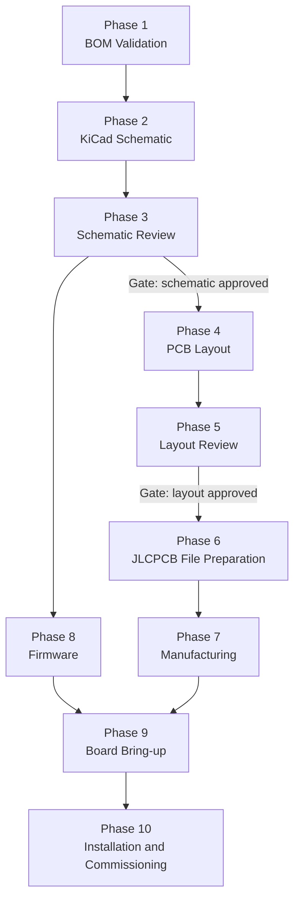
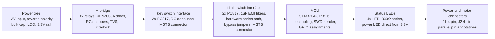
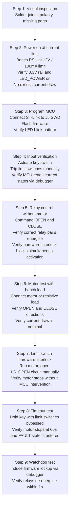

# Pool Cover Control Board: Project Roadmap

**Workflow:** Designer executes each phase. Reviewer (Claude) performs a structured review at each gate before the next phase begins.

---

## Phase Overview

Firmware development (Phase 8) begins after schematic approval and runs in parallel with PCB layout and manufacturing.

---

## Phase 1: BOM Validation

**Objective:** Confirm every component in the preliminary BOM is available at LCSC with the correct specification before schematic entry. Unresolved sourcing issues at this stage propagate into the schematic and cause expensive respins.

**Tasks:**

| Task | Description |
|------|-------------|
| 1.1 | Search LCSC for each component in the preliminary BOM |
| 1.2 | Record the LCSC part number (C-number) for each confirmed part |
| 1.3 | Verify package, rating, and footprint against DESIGN.md specification |
| 1.4 | Identify any out-of-stock or discontinued parts and propose alternatives |
| 1.5 | Classify each part as JLCPCB Basic or Extended (affects assembly surcharge) |
| 1.6 | Update the BOM table in DESIGN.md with confirmed LCSC part numbers |

**Gate:** All components have a confirmed LCSC part number or an approved alternative. No unresolved substitutions.

---

## Phase 2: KiCad Schematic

**Objective:** Produce a complete, annotated schematic in KiCad that is a faithful implementation of DESIGN.md. No design decisions are made during this phase. Deviations require a DESIGN.md amendment before proceeding.

**Sub-circuits to complete in order:**

**Tasks:**

| Task | Description |
|------|-------------|
| 2.1 | Create KiCad project, configure title block with project name and revision |
| 2.2 | Verify or create KiCad symbols for all non-standard parts (HF115F relay, PC817, DMP3028LK3-13) |
| 2.3 | Enter each sub-circuit following the order above |
| 2.4 | Apply net names consistently across all sheets (NET_12V, NET_3V3, KEY_OPEN, LS_CLOSE, etc.) |
| 2.5 | Add power flags to suppress ERC warnings on power nets |
| 2.6 | Annotate all references |
| 2.7 | Run ERC and resolve all errors and warnings |
| 2.8 | Assign LCSC part numbers to each component property field |

**Deliverable:** KiCad schematic file, ERC report showing zero errors.

---

## Phase 3: Schematic Review

**Reviewer:** Claude
**Trigger:** Designer shares schematic (exported PDF or image, or described net by net).

**Review checklist:**

| Area | Items checked |
|------|--------------|
| Power tree | Polarity protection orientation, LDO input/output caps, polyfuse rating, net continuity |
| H-bridge | Relay coil polarity, NC interlock wiring, ULN2003A COM pin connection, snubber placement, TVS orientation |
| Key switch | Optocoupler LED current resistor value, pull-up values, correct signal inversion accounted for in GPIO logic |
| Limit switch | NC contact wired in correct series path with relay coils, 1µF filter caps, optocoupler channels match GPIO assignment |
| MCU | All assigned GPIOs connected, decoupling caps on every VDD/VDDA pin, NRST cap, BOOT0 pulled to GND, SWD header pinout |
| Connectors | Pin 1 orientation, parallel pin annotations on J1 and J2, bypass jumper footprint |
| Global | No floating inputs, no unconnected power pins, net name consistency, ERC clean |

**Gate:** Review passed with no open findings. Any finding requires schematic correction and re-review of the affected sub-circuit before proceeding to layout.

---

## Phase 4: PCB Layout

**Objective:** Produce a manufacturable 4-layer PCB layout in KiCad that respects the zone allocation and electrical constraints defined in DESIGN.md.

**Tasks in order:**

| Task | Description |
|------|-------------|
| 4.1 | Set up design rules: 0.2mm min trace, 0.3mm min via drill, 0.6mm annular ring, 3mm motor trace minimum |
| 4.2 | Define board outline: 100 x 100mm |
| 4.3 | Define layer stackup: L1 signal / L2 GND plane / L3 power / L4 signal |
| 4.4 | Verify or create footprints for all non-standard parts (HF115F, MSTB connectors, blade fuse holder) |
| 4.5 | Place high-current components first: J1, J2, F1, RL1 through RL4 on left/top zone |
| 4.6 | Place logic components: U1, U2, U3, OC1 through OC4 on right zone |
| 4.7 | Place signal connectors and debug header on bottom edge |
| 4.8 | Route motor current path: J1 to F1 to relay contacts to J2, 3mm minimum width, L1 top layer |
| 4.9 | Route relay coil circuits: ULN2003A outputs to relay coil pins, with NC interlock traces clearly routed |
| 4.10 | Route logic signals: MCU GPIO to ULN2003A, optocoupler outputs to MCU |
| 4.11 | Flood L2 as solid GND pour with stitching vias at zone boundary |
| 4.12 | Add 12V and 3.3V pours on L3 |
| 4.13 | Add silkscreen: connector pin labels, JP1/JP2 function labels, board name and revision |
| 4.14 | Add copper pour on LDO SOT-223 tab pad for thermal dissipation |
| 4.15 | Run DRC and resolve all errors |

**Deliverable:** KiCad PCB file, DRC report showing zero errors.

---

## Phase 5: Layout Review

**Reviewer:** Claude
**Trigger:** Designer shares Gerber files or KiCad PCB export (screenshots or layer-by-layer description accepted).

**Review checklist:**

| Area | Items checked |
|------|--------------|
| High-current path | Trace width ≥ 3mm from J1 through fuse, relay contacts, to J2 with no narrow necks |
| Relay interlock | NC interlock traces physically verify correct relay pairs are cross-connected |
| Motor zone isolation | Clear physical separation between relay/motor copper and MCU/logic copper |
| GND plane | L2 solid with no unintended splits under motor traces |
| Decoupling | 100nF caps placed within 1mm of each MCU VDD/VDDA pin |
| LDO thermal | SOT-223 tab connected to copper pour with adequate area |
| Silkscreen | All connectors pin 1 marked, JP1/JP2 function labelled, no silkscreen over pads |
| DRC | Zero errors confirmed |
| JLCPCB design rules | All features within JLCPCB 4-layer standard capability |

**Gate:** Review passed with no open findings.

---

## Phase 6: JLCPCB File Preparation

**Objective:** Generate all files required for PCB fabrication and PCBA in JLCPCB format.

**Tasks:**

| Task | Description |
|------|-------------|
| 6.1 | Export Gerber files: all copper layers, soldermask, silkscreen, board edge |
| 6.2 | Export drill file (Excellon format) |
| 6.3 | Verify Gerbers in an independent viewer (Gerber Viewer or KiCad Gerber viewer) |
| 6.4 | Export BOM in JLCPCB CSV format: reference, value, footprint, LCSC part number |
| 6.5 | Export CPL (Component Placement List) in JLCPCB CSV format: reference, X, Y, rotation, layer |
| 6.6 | Verify CPL coordinates and rotations against KiCad footprint orientation |
| 6.7 | Upload to JLCPCB and configure: 4-layer, 2oz copper, ENIG, 100x100mm, green soldermask |
| 6.8 | Review JLCPCB component availability report and resolve any stock issues |
| 6.9 | Confirm through-hole connector assembly method (hand solder) |
| 6.10 | Review quote, confirm component sourcing, place order |

**Deliverable:** JLCPCB order confirmed, order number recorded.

---

## Phase 7: Manufacturing

**Objective:** Wait for boards. Use the time to advance firmware.

**Typical JLCPCB lead time:** 5 to 10 business days for 4-layer PCBA.

**Tasks during wait:**

| Task | Description |
|------|-------------|
| 7.1 | Monitor order status |
| 7.2 | Prepare bring-up test plan (see Phase 9) |
| 7.3 | Advance firmware development (Phase 8) |
| 7.4 | Prepare enclosure, cable assemblies, and PSU for commissioning |

---

## Phase 8: Firmware Development

Runs in parallel with Phases 4 through 7 after schematic approval.

**Toolchain:** STM32CubeIDE or STM32CubeMX with preferred compiler. HAL or LL layer at designer's discretion.

**Tasks:**

| Task | Description |
|------|-------------|
| 8.1 | Set up STM32CubeIDE project for STM32G031K8T6 |
| 8.2 | Configure clock tree: HSI 16MHz, PLL to 64MHz, no external crystal |
| 8.3 | Configure GPIO: outputs for relay control and LEDs; inputs for key switch, limit switches, bypass sense |
| 8.4 | Configure IWDG watchdog with 1s timeout |
| 8.5 | Implement debounce routine for key switch and limit switch inputs |
| 8.6 | Implement state machine: IDLE, OPENING, CLOSING, FAULT |
| 8.7 | Implement 60s motor timeout using SysTick or TIM |
| 8.8 | Implement bypass jumper detection on power-up |
| 8.9 | Implement LED output logic per state |
| 8.10 | Validate state machine logic on STM32 Nucleo board with GPIO switches as stimulus |
| 8.11 | Verify watchdog behaviour: confirm all relays de-energise on lockup |

**Deliverable:** Tested firmware binary, source in version control.

---

## Phase 9: Board Bring-up

**Objective:** Systematically verify hardware from power rail to full motor operation. Do not power an untested board at full PSU current on first power-on.

**Bring-up sequence:**

**Gate:** All nine steps pass. Any failure requires diagnosis, correction, and re-execution from the affected step.

---

## Phase 10: Installation and Commissioning

**Objective:** Install the board in the field enclosure, connect all external wiring, and commission with the actual pool cover motor.

**Tasks:**

| Task | Description |
|------|-------------|
| 10.1 | Apply conformal coating to fully tested PCB and allow to cure |
| 10.2 | Mount PCB in IP65 enclosure |
| 10.3 | Wire J1 PSU input: 12V and GND from PSU output terminals |
| 10.4 | Wire J2 motor output: 6mm² cable to motor, 20m run in dedicated conduit |
| 10.5 | Wire J3 key switch: 3-core signal cable to key switch box, 20m run in separate conduit |
| 10.6 | Wire J4 limit switches: 3-core signal cable from motor mechanism, 20m run in separate conduit |
| 10.7 | Power on and verify LED_POWER on |
| 10.8 | Test OPEN command: motor runs, cover moves, stops at mechanical limit |
| 10.9 | Test CLOSE command: motor runs, cover moves, stops at mechanical limit |
| 10.10 | Verify limit switch trip points and adjust switch positions if necessary |
| 10.11 | Test bypass jumpers JP1/JP2 and confirm LED_FAULT blink warning |
| 10.12 | Remove bypass jumpers after confirming limit switches are functional |
| 10.13 | Seal enclosure and complete installation |

---

## Open Items

| Reference | Description | Blocking phase |
|-----------|-------------|---------------|
| OI-1 | Motor actual current draw unknown. Verify at commissioning and re-rate fuse if necessary. | Phase 10 |
| OI-2 | Limit switch type at motor mechanism unconfirmed. Verify NC contact before wiring J4. | Phase 10 |
| OI-3 | Key switch wiring continuity not yet verified with multimeter. Confirm before wiring J3. | Phase 10 |
